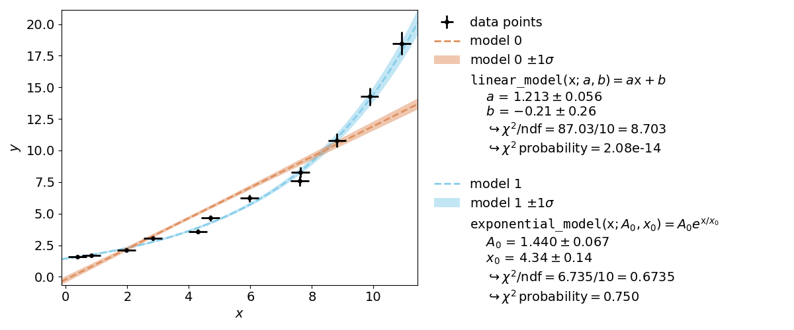
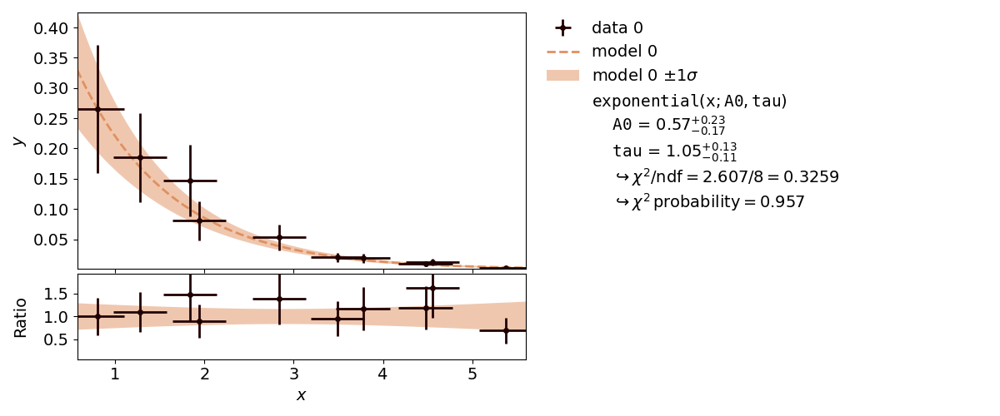
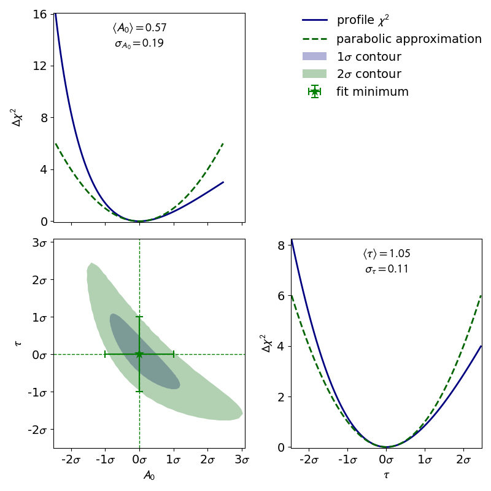
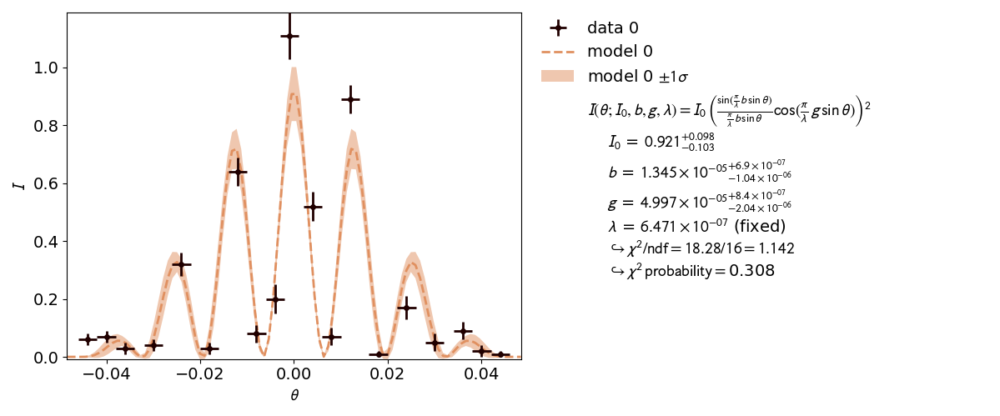
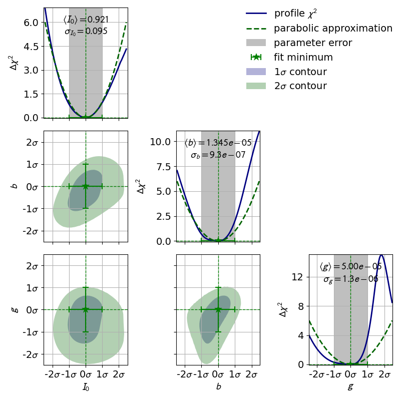
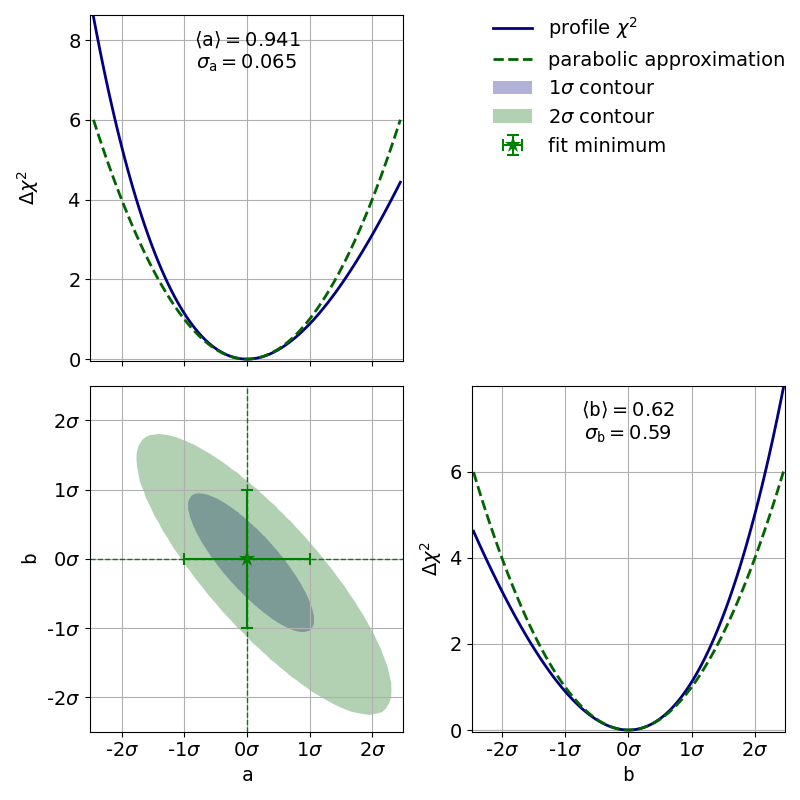
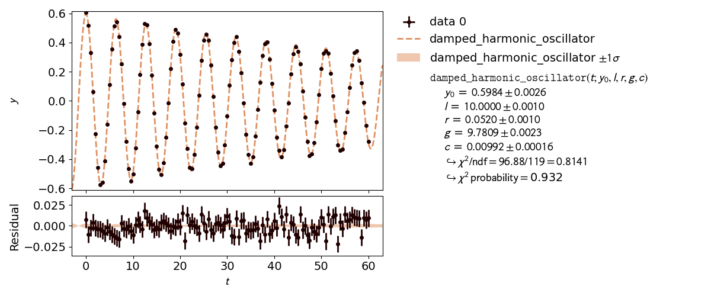
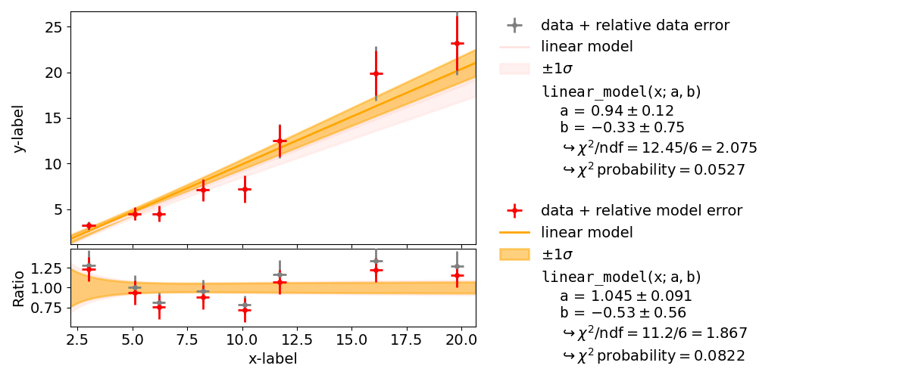
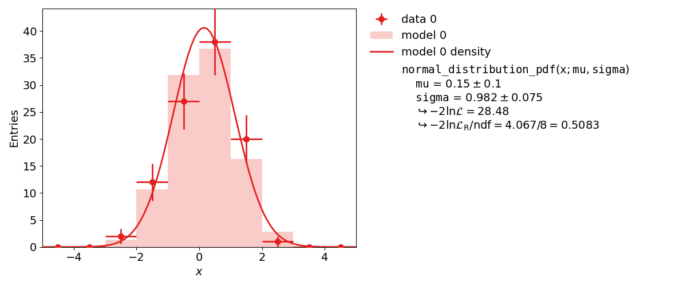

.. meta::
   :description lang=en: kafe2 - a Python package for fitting parametric
                         models to several types of data
   :robots: index, follow

.. role:: python(code)

.. _beginners_guide:

***************
Beginners Guide
***************

This section covers the basics of using *kafe2* for fitting parametric models to data by
showing examples.
Specifically, it teaches users how to specify measurement data and uncertainties, how to specify
model functions, and how to extract the fit results.

An interactive `*Jupyter* <https://jupyter.org/>`__ Notebook teaching the usage of the *kafe2*
*Python* interface is available in
`English <https://github.com/PhiLFitters/kafe2/blob/master/examples/jupyter_tutorial_en.ipynb>`__ and
`German <https://github.com/PhiLFitters/kafe2/blob/master/examples/jupyter_tutorial_de.ipynb>`__.
The use of the aforementioned *Jupyter* notebooks is recommended

More detailed information for the advanced use of *kafe2* is found in the :ref:`user_guide` and
in the :ref:`user_guide_kafe2go`.

Basic Fitting Procedure
=======================

Generally, any fit performed by *kafe2* requires the specification of some sort of data.
This uncertainties of said data usually also need to be defined in order to calculate parameter
uncertainties.
A specific model function can also be defined; depending on the data type there are defaults
(e.g. a straight line for *xy* data).

Using kafe2go
-------------
Using *kafe2go* is the simplest way of performing a fit. Here all the necessary information and
properties like data and uncertainties are specified in a *YAML* file (`.yml` and `.yaml` file
extension).
To perform the fit, simply run:

.. code-block:: bash

    kafe2go path/to/fit.yml

Using Python
------------
When using *kafe2* via a *Python* script it is possible to precisely control how fits are performed
and plotted.
However, because there is an inherent tradeoff between complexity and ease of use simplified
interfaces for the most common use cases exist.
The simplified interfaces in the documentation are functions called directly on the *kafe2* module.
The code looks something like this:

.. code-block:: python

    import kafe2
    kafe2.xy_fit("line", x_data, y_data, y_error=my_y_error)
    kafe2.plot()

The mode complex object-oriented interface imports the objects from the *kafe2* module instead:

.. code-block:: python

    from kafe2 import XYFit, Plot

Notice how the objects are capitalized according to CamelCase while the simplified functions are
written with snake_case.
The difference in how the interfaces are imported is entirely arbitrary and only serves to highlight
the difference for educational purposes.

If a code example contains a line similar to :python:`data = XYContainer.from_file("data.yml")`
then a *kafe2* object is loaded from a *YAML* file on disk.
The corresponding *YAML* files can found in the same directory that contains the example Python
script.

All example files are available on
`GitHub <https://github.com/PhiLFitters/kafe2/tree/master/examples>`__.

1. Line Fit
===========
The simplest, and also the most common use case of a fitting framework
is performing a line fit: A linear function of the form
:math:`f(x) = a * x + b` is made to align with a series of *xy* data points that
have some uncertainty along the *x* axis and the *y* axis.
This example demonstrates how to perform such a line fit in kafe2 and
how to extract the results.

.. figure:: ../_static/img/001_line_fit.png
    :alt: Plot of a line fit performed with kafe2.

kafe2go
-------
To run this example, open a text editor and save the following file contents
as a *YAML* file named :file:`line_fit.yml`.

.. literalinclude:: ../../../examples/001_line_fit/line_fit.yml
    :language: yaml

Then open a terminal, navigate to the directory where the file is
located and run

.. code-block:: bash

    kafe2go line_fit.yml

Python
------
The same fit can also be performed by using a *Python* script.

.. bootstrap_collapsible::
    :control_type: link
    :control_text: python code

    .. literalinclude:: ../../../examples/001_line_fit/line_fit.py
        :lines: 14-

If you're performing the fit via *Python* code there should be two plots.
The second plot which shows the so-called profile likelihood ("contour plot")
will be explained in the next chapter.

2. Model Functions
==================

In experimental physics a line fit will only suffice for a small number
of applications. In most cases you will need a more complex model function
with more parameters to accurately model physical reality.
This example demonstrates how to specify arbitrary model functions for
a *kafe2* fit.
When a different function has to be fitted, those functions need to be defined either in the
*YAML* file or the *Python* script.

The graphical output itself does not clearly indicate which of the models is acceptable.
For this purpose a hypothesis test can be performed which indicates the so-called :math:`\chi^2`
probability - i.e. the probability of obtaining a worse value for :math:`\chi^2` at the
minimum than the observed one.
A higher value corresponds to a better fit.
The :math:`\chi^2` probability of a fit is shown inside the fit info box on the right.

An exponential function is a **non-linear** function!
**Non-linear** refers to the linearity of the parameters.
Any polynomial like :math:`ax^2+bx+c` is a linear function of the parameters
:math:`a`, :math:`b` and :math:`c`.
An exponential function :math:`A_0 e^{(x/x_0)}` is **non-linear** in its parameter :math:`x_0`.
Thus the profile of :math:`\chi^2` can have a non-parabolic shape.
If that is the case, uncertainties of the form :math:`a\pm\delta_a` won't be accurate.
Please refer to :ref:`profiling` for more information.

To see the shape of the profiles and contours, please create a contour plot of the fitted
parameters.
This can be done by appending the ``-c`` or ``--contours`` option to *kafe2go*.
Additionally a grid can be added to the contour plots with the ``--grid all`` flag.

With the simplified *Python* interface a contour plot is created automatically when *x* errors or
relative *y* errors are specified or when setting the keyword argument ``profile=True``.
The object-oriented interface uses the ``ContoursProfiler`` object
the usage of which is shown further down.

The corresponding contour plot for the exponential fit shown above looks like this:

.. figure:: ../_static/img/002_exponential_contours.png
    :alt: Corresponding contour plot for the exponential fit.

When looking at the :math:`\chi^2` profiles of the parameters, a deformation is effectively not
present.
In this case the fit results and uncertainties are perfectly fine and are can be used as is.
See :ref:`profiling` for more information.

kafe2go
-------
Inside a *YAML* file custom fit functions can be defined with the ``model_function`` keyword.
The default way to define said model functions is to write a function *Python* function.
*NumPy* and *SciPy* functions are supported without extra import
statements, as shown in the example.
Alternatively model functions can be defined via *SymPy* (symbolic Python).
The part of the model function left of the string ``->`` is interpreted as *SymPy* symbols,
the part on the right is interpreted as a *SymPy* expression using said symbols.
The leftmost part of the string up to ``:`` is interpreted as the model function name
(can be omitted).

For more advanced fit functions, consider using *kafe2* inside a *Python* script.

.. bootstrap_collapsible::
    :control_type: link
    :control_text: exponential_fit.yml

    .. literalinclude:: ../../../examples/002_model_functions/exponential_fit.yml
        :language: yaml
        :emphasize-lines: 38-43

.. bootstrap_collapsible::
    :control_type: link
    :control_text: line_fit.yml

    .. literalinclude:: ../../../examples/002_model_functions/line_fit.yml
        :language: yaml
        :emphasize-lines: 38-43

To use multiple input files with kafe2go, simply run

.. code-block:: bash

    kafe2go path/to/fit1.yml path/to/fit2.yml

To plot the fits in two separate figures append the ``--separate`` flag to the kafe2go command.

.. code-block:: bash

    kafe2go path/to/fit1.yml path/to/fit2.yml --separate

For creating a contour plot, simply add ``-c`` to the command line. This will create contour plots
for all given fits.

.. code-block:: bash

    kafe2go path/to/fit1.yml path/to/fit2.yml --separate -c

Python
------
When using *Python* multiple model functions can be defined in the same file.
They are plotted together by first calling ``kafe2.xy_fit`` multiple times and then calling
``kafe2.plot``.

.. bootstrap_collapsible::
    :control_type: link
    :control_text: python code

    .. literalinclude:: ../../../examples/002_model_functions/model_functions.py
        :lines: 13-

.. _profiling:

3.1: Profiling
==============

Very often, when the fit model is a non-linear function of the parameters, the :math:`\chi^2`
function is not parabolic around the minimum.
A very common example of such a case is an exponential function parametrized as shown in this
example.

In the case of a nonlinear fit, the minimum of a :math:`\chi^2` cost function is no longer shaped
like a parabola (with a model parameter on the *x* axis and :math:`\chi^2` on the *y* axis).
Now, you might be wondering why you should care about the shape of the :math:`\chi^2` function.
The reason why it's important is that the common notation of :math:`p\pm\sigma` for fit results
is only valid for a parabola-shaped cost function.
If your likelihood function is distorted it will also affect your fit results!

Luckily nonlinear fits oftentimes still produce meaningful fit results as long as the distortion is
not too big - you just need to be more careful during the evaluation of your fit results.
A common approach for handling nonlinearity is to trace the profile of the cost function
(in this case :math:`\chi^2`) in either direction of the cost function minimum and find the points
at which the cost function value has increased by a specified amount relative to the cost function
minimum.
In other words, two cuts are made on either side of the cost function minimum at a specified height.
The two points found with this approach span a confidence interval for the fit parameter around the
cost function minimum.
The confidence level of the interval depends on how high you set the cuts for the cost increase
relative to the cost function minimum.
The one sigma interval described by conventional parameter errors is achieved by a cut at the fit
minimum plus :math:`1^2=1` and has a confidence level of about 68%.
The two sigma interval is achieved by a cut at the fit minimum plus :math:`2^2=4` and has a
confidence level of about 95%, and so on.
The one sigma interval is commonly described by what is called asymmetric errors:
the interval limits are described relative to the cost function minimum as
:math:`p^{+\sigma_\mathrm{up}}_{-\sigma_\mathrm{down}}`.

In addition to non-linear function, the usage of x data errors leads to a non-linear fits as well.
This is shown in :ref:`x_errors`.

kafe2go
-------

To display asymmetric parameter uncertainties use the flag ``-a``. In addition the profiles and
contours can be shown by using the ``-c`` flag. In the *Python* example a ratio between the data
and model function is shown below the plot. This can be done by appending the ``-r`` flag to
*kafe2go*.

.. bootstrap_collapsible::
    :control_type: link
    :control_text: non_linear_fit.yml

    .. literalinclude:: ../../../examples/003_profiling/01_non_linear_fit.yml
        :language: yaml

Python
------

From this point on the examples use the object-oriented *Python* interface.
For a quick intorduction consider this code that is mostly equivalent to the very first example of
a straight line with *xy* errors:

.. bootstrap_collapsible::
    :control_type: link
    :control_text: object_oriented_programming.py

    .. literalinclude:: ../../../examples/003_profiling/00_object_oriented_programming.py
        :lines: 16-

Now for the actual example.
The relevant lines to display asymmetric uncertainties and to create the contour plot are
highlighted in the code example below.

.. bootstrap_collapsible::
    :control_type: link
    :control_text: non_linear_fit.py

    .. literalinclude:: ../../../examples/003_profiling/01_non_linear_fit.py
        :lines: 27-
        :emphasize-lines: 22, 26, 28-30

3.2: Double Slit
================

A real world example, when asymmetric parameter uncertainties are needed is the double slit
experiment. Here the model function is highly non-linear.

This is also reflected by the highly distorted contours.

kafe2go
-------
A *YAML* file for this example is available on
`GitHub <https://github.com/PhiLFitters/kafe2/tree/master/examples/003_profiling>`__.
It works perfectly fine with kafe2go, but is not edited to a compact form.
It is in fact a direct dump from the fit object used in the python script.
*kafe2* supports writing fits and datasets to a kafe2go compatible file with the
:code:`data.to_file("my.yml")` and :code:`fit.to_file("filename.yml")` methods as well as
reading them with the corresponding classes like :code:`XYContainer.from_file("my.yml")` and
:code:`XYFit.from_file("filename.yml")` as shown in the *Python* example.

Python
------

.. bootstrap_collapsible::
    :control_type: link
    :control_text: 02_double_slit.py

    .. literalinclude:: ../../../examples/003_profiling/02_double_slit.py
        :lines: 13-

.. _x_errors:

3.3: x-Errors:
==============
In addition to non-linear function, the usage of x data errors leads to a non-linear fits as well.
kafe2 fits support the addition of x data errors - in fact we've been using them since the very
first example.
To take them into account the x errors are converted to y errors via multiplication with the
derivative of the model function.
In other words, kafe2 fits extrapolate the derivative of the model function at the x data values
and calculate how a difference in the x direction would translate to the y direction.
Unfortunately this approach is not perfect though.
Since we're extrapolating the derivative at the x data values, we will only receive valid results
if the derivative doesn't change too much at the scale of the x error.
Also, since the effective y error has now become dependent on the derivative of the model function
it will vary depending on our choice of model parameters.
This distorts our likelihood function - the minimum of a :math:`\chi^2` cost function will no
longer be shaped like a parabola (with a model parameter on the x axis and :math:`\chi^2` on the
y axis).

To demonstrate this, the second file ``x_errors`` will perform a line fit with much bigger
uncertainties on the x axis than on the y axis. The non-parabolic shape can be seen in the
one-dimensional profile scans.

The effects of this deformation are explained in :ref:`profiling`.

kafe2go
-------

Keep in mind that *kafe2go* will perform a line fit if no fit function has been specified.
In order do add a grid to the contours, run *kafe2go* with the ``--grid all`` flag.
So to plot with asymmetric errors, the profiles and contour as well as a grid run
``kafe2go x_errors.yml -a -c --grid all``

.. bootstrap_collapsible::
    :control_type: link
    :control_text: x_errors.yml

    .. literalinclude:: ../../../examples/003_profiling/03_x_errors.yml
        :language: yaml

Python
------

The example to show that uncertainties on the x axis can cause a non-linear fit uses the *YAML*
dataset given in the *kafe2go* section.

.. bootstrap_collapsible::
    :control_type: link
    :control_text: x_errors.py

    .. literalinclude:: ../../../examples/003_profiling/03_x_errors.py
        :lines: 19-

4: Constraints
==============

The models used to describe physical phenomena usually depend on a multitude of parameters.
However, for many experiments only one of the parameters is of actual interest to the experimenter.
Still, because model parameters are generally not uncorrelated the experimenter has to factor in
the nuisance parameters for their estimation of the parameter of interest.

Historically this has been done by propagating the uncertainties of the nuisance parameters onto
the y-axis of the data and then performing a fit with those uncertainties.
Thanks to computers, however, this process can also be done numerically by applying parameter
constraints. This example demonstrates the usage of those constraints in the kafe2 framework.

More specifically, this example will simulate the following experiment:

A steel ball of radius :math:`r` has been connected to the ceiling by a string of length :math:`l`,
forming a pendulum. Due to earth's gravity providing a restoring force this system is a harmonic
oscillator. Because of friction between the steel ball and the surrounding air the oscillator is
also damped by the viscous damping coefficient :math:`c`.

The goal of the experiment is to determine the local strength of earth's gravity :math:`g`. Since
the earth is shaped like an ellipsoid the gravitational pull varies with latitude: it's strongest
at the poles with :math:`g_p=9.832\,\mathrm{m}/\mathrm{s}^2` and it's weakest at the equator with
:math:`g_e=9.780\,\mathrm{m}/\mathrm{s}^2`. For reference, at Germany's latitude :math:`g` lies at
approximately :math:`9.81\,\mathrm{m}/\mathrm{s}^2`.

          gravitational pull g.

kafe2go
-------
Parameter constraints are straightforward to use with *kafe2go*. After defining the model function
parameter constraints can be set. Simple gaussian constraints can be defined with the parameter name
followed by the required information as highlighted in the example.
For more information on parameter constraints via a covariance matrix, please refer to
:ref:`kafe2go_constraints`.

.. bootstrap_collapsible::
    :control_type: link
    :control_text: constraints.yml

    .. literalinclude:: ../../../examples/004_constraints/constraints.yml
        :language: yaml
        :emphasize-lines: 58-

Python
------
Using *kafe2* inside a *Python* script, parameter constraints can be set with
``fit.add_parameter_constraint()``. The according section is highlighted in the code example below.

.. bootstrap_collapsible::
    :control_type: link
    :control_text: constraints.py

    .. literalinclude:: ../../../examples/004_constraints/constraints.py
        :lines: 30-
        :emphasize-lines: 30-33

5: Convenience
==============

This part includes examples, designed to be used as cheat sheets.

Plot Customization
------------------
This example is a cheat sheet for plot/report customization.
It briefly demonstrates methods that modify the optics of kafe2 output.

.. bootstrap_collapsible::
    :control_type: link
    :control_text: customize.py

    .. literalinclude:: ../../../examples/005_convenience/customize.py
        :lines: 9-

Accessing Fit Data via Properties
---------------------------------
In the previous kafe2 examples we retrieved kafe2 results in a human-readable form via
reports and plots.
This example demonstrates how these fit results can instead be retrieved as Python variables.

.. bootstrap_collapsible::
    :control_type: link
    :control_text: customize.py

    .. literalinclude:: ../../../examples/005_convenience/properties.py
        :lines: 10-

Saving Fits
-----------
Most kafe2 objects can be turned into the human-readable YAML format and written to a file.
These files can then be used to load the objects into Python code or as input for kafe2go.

.. bootstrap_collapsible::
    :control_type: link
    :control_text: customize.py

    .. literalinclude:: ../../../examples/005_convenience/to_file.py
        :lines: 9-

6.1: Covariance matrix
======================

kafe2go
-------

.. bootstrap_collapsible::
    :control_type: link
    :control_text: 01_covariance_matrix.yml

    .. literalinclude:: ../../../examples/006_advanced_errors/01_covariance_matrix.yml
        :language: yaml

Python
------

.. bootstrap_collapsible::
    :control_type: link
    :control_text: 01_covariance_matrix.py

    .. literalinclude:: ../../../examples/006_advanced_errors/01_covariance_matrix.py
        :lines: 23-

6.2: Error components
=====================

Typically, the uncertainties of the measurement data are much more complex than in the examples
discussed so far.
In most cases there are uncertainties in ordinate and abscissa, and in addition to the independent
uncertainties of each data point there are common, correlated uncertainties for all of them.

With the method :code:`add_error()` or :code:`add_matrix_error()` uncertainties can be specified on
the 'x' and 'y' data, either in the form of independent or correlated, relative or absolute
uncertainties of all or groups of measured values or by specifying the complete covariance or
correlation matrix.
All uncertainties specified in this way are included in the global covariance matrix for the fit.

As an example, we consider measurements of a cross section as a function of the energy near a
resonance.
These are combined measurement data from the four experiments at CERN's LEP accelerator,
which were corrected for effects caused by photon radiation: Measurements of the hadronic cross
section (:math:`\sigma`) as a function of the centre-of-mass energy (:math:`E`).

Python
------

.. bootstrap_collapsible::
    :control_type: link
    :control_text: 02_error_components.py

    .. literalinclude:: ../../../examples/006_advanced_errors/02_error_components.py
        :lines: 18-

6.3: Relative uncertainties
===========================

We had already seen that kafe2 allows the declaration of relative uncertainties which we want to
examine more closely in this example.
Adjustments with relative uncertainties suffer from the fact that the estimate of the parameter
values is distorted.
This is because measured values that fluctuate to smaller values have smaller uncertainties;
the uncertainties are correspondingly greater when the measured values fluctuate upwards.
If the random fluctuations were exactly the other way round, other uncertainties would be assigned.
It would be correct to relate the relative uncertainties to the true values, which we do not know.
Instead, the option reference='model' allows the uncertainties to be dependent on the model value
- still not completely correct, but much better.

          relative to the model.

As seen in the example, the :math:`\chi^2` probability improves from around :math:`0.05` to
:math:`0.08` and :math:`\chi^2/\mathrm{ndf}` improves from :math:`2.1` to :math:`1.9`.

kafe2go
-------
For using uncertainties relative to the model, The :code:`parametric_model` section must be added
inside the *YAML* file, as highlighted below.
For comparison, one cane move the *y*-uncertainty out of the :code:`parametric_model` section.
Then the uncertainty will be relative to the data.

.. bootstrap_collapsible::
    :control_type: link
    :control_text: relative_uncertainties.py

    .. literalinclude:: ../../../examples/006_advanced_errors/03_relative_model_uncertainties.yml
        :language: yaml
        :emphasize-lines: 11-15

Python
------
Referencing the model as source for relative uncertainties is done by setting the keyword
:code:`reference='model'` in the :py:meth:`~.XYFit.add_error` method.

.. bootstrap_collapsible::
    :control_type: link
    :control_text: relative_uncertainties.py

    .. literalinclude:: ../../../examples/006_advanced_errors/03_relative_uncertainties.py
        :lines: 13-
        :emphasize-lines: 11, 18

7: Poisson Cost Function
==========================

In data analysis the uncertainty on measurement data is most often assumed to resemble a normal
distribution.
For many use cases this assumption works reasonably well but there is a problem:
to get meaningful fit results you need to know about the uncertainties of your measurements.
Now imagine for a moment that the quantity you're measuring is the number of radioactive decays
coming from some substance in a given time period.
What is your data error in this case?
The precision with that you can correctly count the decays?
The answer is that due to the inherently random nature of radioactive decay the variance,
and therefore the uncertainty on your measurement data directly follows from the mean number of
decays in a given time period - the number of decays are following a poisson distribution.
In kafe2 this distribution can be modeled by initializing a fit object with a special cost function.
In previous examples when no cost function was provided a normal distribution has been assumed by
default.
It is important to know that for large numbers of events a poisson distribution can be approximated
by a normal distribution (y_error = sqrt(y_data)).

For our example on cost functions we imagine the following, admittedly a little contrived scenario:
In some remote location on earth archeologists have found the ruins of an ancient civilization.
They estimate the ruins to be about 7000 years old.
The civilization in question seems to have known about mathematics and they even had their own
calendar.
Unfortunately we do not know the exact offset of this ancient calendar relative to our modern
calendar.
Luckily the ancient civilization seems to have mummified their rulers and written down their years
of death though.
Using a method called radiocarbon dating we can now try to estimate the offset between the ancient
and the modern calendar by analyzing the relative amounts of carbon isotopes in the mummified
remains of the ancient kings.
More specifically, we take small samples from the mummies, extract the carbon from those samples
and then measure the number of decaying carbon-14 atoms in our samples.
Carbon-14 is a trace radioisotope with a half life of only 5730 years that is continuously being
produced in earth's upper atmosphere.
In a living organism there is a continuous exchange of carbon atoms with its environment which
results in a stable concentration of carbon-14.
Once an organism dies, however, the carbon atoms in its body are fixed and the concentration of
carbon-14 starts to exponentially decrease over time.
If we then measure the concentration of carbon-14 in our samples we can then calculate at which
point in time they must have contained atmospheric amounts of carbon-14, i.e. the times of death of
the ancient kings.

Python
------

.. bootstrap_collapsible::
    :control_type: link
    :control_text: 01_poisson_cost_function.py

    .. literalinclude:: ../../../examples/007_cost_functions/01_poisson_cost_function.py
        :lines: 35-

8: Indexed Fit
==============

In progress...

9: Histogram Fit
================

*kafe2* is not only capable of performing XY-Fits.
One way to handle one-dimensional data with *kafe2* is by fitting a histogram.
The distribution of a random stochastic variable follows a probability density function.
The fit will determine the parameters of that density function, which the dataset is most likely
to follow.
To get to the height of a bin, multiply the results of the fitted function with the amount
of entries N of the histogram.

kafe2go
-------
In order to tell *kafe2go* that a fit is a histogram fit ``type: histogram`` has to specified
inside the *YAML* file.

.. bootstrap_collapsible::
    :control_type: link
    :control_text: histogram.yml

    .. literalinclude:: ../../../examples/009_histogram_fit/histogram.yml
        :language: yaml
        :emphasize-lines: 1

Python
------
To use a histogram fit in a *Python* script, just import it with
:python:`from kafe2 import HistContainer, HistFit`.

The creation a a histogram requires the user to set the limits of the histogram and the amount of
bins.
Alternatively the bin edges for each bin can be set manually.

.. bootstrap_collapsible::
    :control_type: link
    :control_text: histogram_fit.py

    .. literalinclude:: ../../../examples/009_histogram_fit/histogram_fit.py
        :lines: 16-

10: Unbinned Fit
================

An unbinned fit is needed when there are too few data points to create a (good) histogram.
If a histogram is created from too few data points information can be lost or even changed by
changing the exact value of one data point to the range of a bin.
With an unbinned likelihood fit it's still possible to fit the probability density function to the
data points, as the likelihood of each data point is fitted.

.. figure:: ../_static/img/010_unbinned_fit.png
    :alt: An unbinned likelihood fit performed with kafe2.

Inside a *kafe2* fit, single parameters can be fixed as seen in the plot.
When fixing a parameter, there must be a good reason to do so. In this case it's the normalization
of the probability distribution function.
This, of course, could have been done inside the function itself.
But if the user wants to change to normalization without touching the distribution function, this
is a better way.

kafe2go
-------
Similar to histogram fits, unbinned fits are defined by ``type: unbinned`` inside the *YAML* file.
How to fix single parameters is highlighted in the example below, as well as limiting the
background ``fbg`` to physically correct values.

.. bootstrap_collapsible::
    :control_type: link
    :control_text: unbinned.yml

    .. literalinclude:: ../../../examples/010_unbinned_fit/01_unbinned.yml
        :language: yaml
        :emphasize-lines: 43-47

Python
------
The fitting procedure is similar to the one of a histogram fit.
How to fix single parameters is highlighted in the example below.

.. bootstrap_collapsible::
    :control_type: link
    :control_text: unbinned.py

    .. literalinclude:: ../../../examples/010_unbinned_fit/01_unbinned.py
        :lines: 19-
        :emphasize-lines: 35-40

11: Multifit
============

The premise of this example is deceptively simple: a series
of voltages is applied to a resistor and the resulting current
is measured. The aim is to fit a model to the collected data
consisting of voltage-current pairs and determine the
resistance :math:`R`.

According to Ohm's Law, the relation between current and voltage
is linear, so a linear model can be fitted. However, Ohm's Law
only applies to an ideal resistor whose resistance does not
change, and the resistance of a real resistor tends to increase
as the resistor heats up. This means that, as the applied voltage
gets higher, the resistance changes, giving rise to
nonlinearities which are ignored by a linear model.

To get a hold on this nonlinear behavior, the model must take
the temperature of the resistor into account. Thus, the
temperature is also recorded for every data point.
The data thus consists of triples, instead of the usual "xy" pairs,
and the relationship between temperature and voltage must be
modeled in addition to the one between current and voltage.

Here, the dependence :math:`T(U)` is taken to be quadratic, with
some coefficients :math:`p_0`, :math:`p_1`, and :math:`p_2`:

.. math::

    T(U) = p_2 U^2 + p_1 U + p_0

This model is based purely on empirical observations. The :math:`I(U)`
dependence is more complicated, but takes the "running" of the
resistane with the temperature into account:

.. math::

    I(U) = \frac{U}{R_0 (1 + t \cdot \alpha_T)}

In the above, :math:`t` is the temperature in degrees Celsius,
:math:`\alpha_T` is an empirical "heat coefficient", and :math:`R_0`
is the resistance at 0 degrees Celsius, which we want to determine.

In essence, there are two models here which must be fitted to the
:math:`I(U)` and :math:`T(U)` data sets, and one model "incorporates"
the other in some way.

Approach 1: parameter constraints
---------------------------------

There are several ways to achieve this with *kafe2*. The method chosen
here consists of two steps: First, a quadratic model is fitted to the
:math:`T(U)` datasets to estimate the parameters :math:`p_0`, :math:`p_1`
and :math:`p_2` and their covariance matrix.

Next, the :math:`I(U)` model is fitted, with the temperature :math:`t`
being explicitly replaced by its parameterization as a function of
:math:`p_0`, :math:`p_1` and :math:`p_2`. The key here is to fit these
parameters again from the :math:`I(U)` dataset, but to constrain them
to the values obtained in the previous :math:`T(U)` fit.

In general, this approach yields different results than the one using
a simultaneous multi-model fit, which is demonstrated in the next example.

.. bootstrap_collapsible::
    :control_type: link
    :control_text: 01_fit_with_parameter_constraints.py

    .. literalinclude:: ../../../examples/011_multifit/01_fit_with_parameter_constraints.py
        :lines: 71-

Approach 2: multi-model fit
---------------------------

There are several ways to achieve this with *kafe2*. The method chosen
here is to use the :py:class:`~kafe.fit.multi.Multifit` functionality
to fit both models simultaneously to the :math:`T(U)` and :math:`I(U)`
datasets.

In general, this approach yields different results than the one using
parameter constraints, which is demonstrated in the example called
``fit_with_parameter_constraints``.

.. bootstrap_collapsible::
    :control_type: link
    :control_text: 02_multifit.py

    .. literalinclude:: ../../../examples/011_multifit/02_multifit.py
        :lines: 65-
