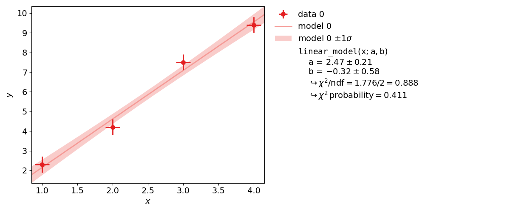
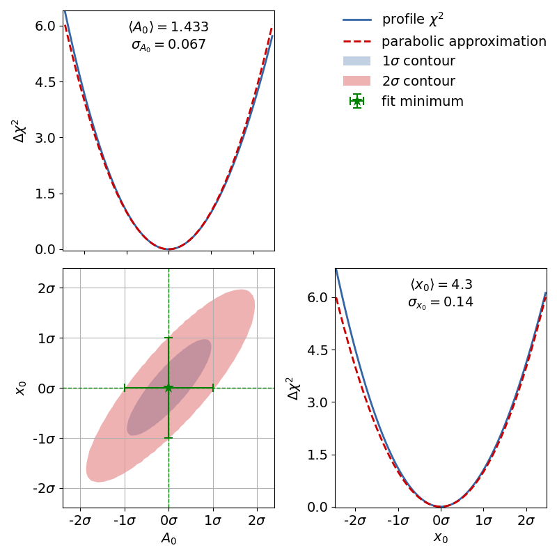
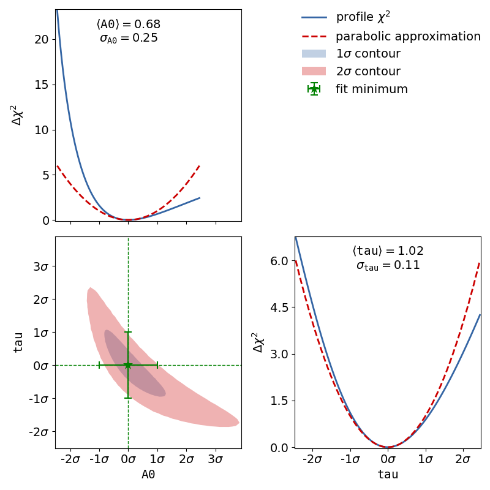
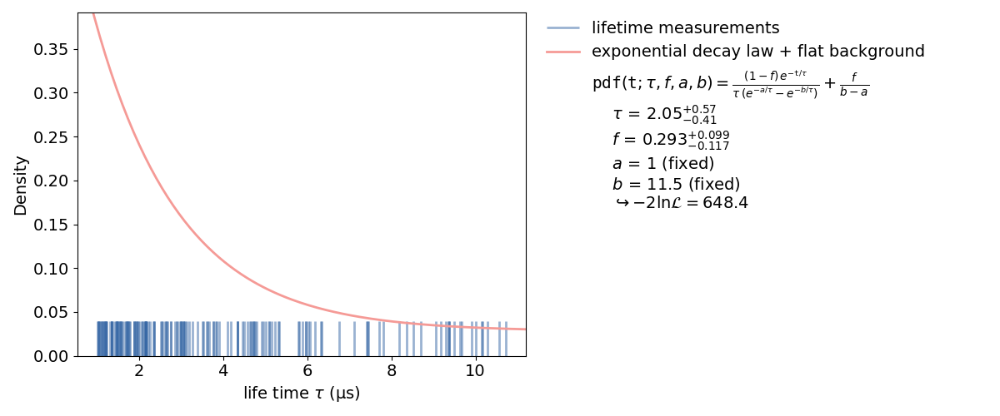

.. meta::
   :description lang=en: kafe2 - a Python package for fitting parametric
                         models to several types of data
   :robots: index, follow

.. role:: python(code)

.. _beginners_guide:

***************
Beginners Guide
***************

This section covers the basics of using *kafe2* for fitting parametric models to data by
showing examples.
Specifically, it teaches users how to specify measurement data and uncertainties, how to specify
model functions, and how to extract the fit results.

An interactive `Jupyter <https://jupyter.org/>`_ Notebook teaching the usage of *kafe2* with
*Python* is available in
`English <https://github.com/dsavoiu/kafe2/blob/master/examples/jupyter_tutorial_en.ipynb>`_ and
`German <https://github.com/dsavoiu/kafe2/blob/master/examples/jupyter_tutorial_de.ipynb>`_.

More detailed information for the advanced use of *kafe2* is found in the :ref:`user-guide` and
in the :ref:`api-documentation`.

Basic Fitting Procedure
=======================

Generally, any simple fit performed by *kafe2* can be divided into the following steps:

1. Specifying the data
2. Specifying the uncertainties
3. Specifying the model function
4. Performing the fit
5. Extracting the fit results

This document will gradually introduce the above steps via example code.

Using kafe2go
-------------
Using *kafe2go* is the simplest way of performing a fit. Here all the necessary information and
properties like data and uncertainties are specified in a *YAML* file (`.yml` file extension).
To perform the fit, simply run:

.. code-block:: bash

    kafe2go path/to/fit.yml

Using Python
------------
When using *kafe2* via a *Python* script it is possible to precisely control how fits are performed
and plotted.
For using *kafe2* inside a *Python* script, import the required *kafe2* modules:

.. code-block:: python

    from kafe2 import XYFit, Plot

If a code example contains a line similar to :python:`data = XYContainer.from_file("data.yml")`
the corresponding YAML file can be found in the same directory that contains the example Python
script.
The example files can be found on
`GitHub <https://github.com/dsavoiu/kafe2/tree/master/examples>`_.

Example 1: Line Fit
===================
The first example is the simplest use of a fitting framework: performing a line fit.
A linear function of the form :math:`f(x;a, b) = a x + b` is made to align with
a series of xy data points that have some uncertainty along the x-axis
and the y-axis.
This example demonstrates how to perform such a line fit in kafe2 and
how to extract the results.

kafe2go
-------
To run this example, open a text editor and save the following file contents
as a *YAML* file named :file:`line_fit.yml`.

.. literalinclude:: ../../../examples/001_line_fit/line_fit.yml

Then open a terminal, navigate to the directory where the file is
located and run

.. code-block:: bash

    kafe2go line_fit.yml

Python
------
The same fit can also be performed by using a *Python* script.

.. bootstrap_collapsible::
    :control_type: link
    :control_text: python code

    .. literalinclude:: ../../../examples/001_line_fit/line_fit.py
        :lines: 15-

Example 2: Model Functions
==========================

In experimental physics a line fit will only suffice for a small number
of applications. In most cases you will need a more complex model function
with more parameters to accurately model physical reality.
This example demonstrates how to specify arbitrary model functions for
a kafe2 fit.
When a different function has to be fitted, those functions need to be defined either in the
*YAML* file or the *Python* script.

:math:`\chi^2/\mathrm{ndf}` has an expected value of 1, if both the model function and the error
estimates are correct.
When using the same dataset and error estimates a smaller value of :math:`\chi^2/\mathrm{ndf}`
means a better fit.
Thus the exponential function describes the dataset more accurately than the line function.

An exponential function is a **non-linear** function!
**Non-linear** refers to the linearity of the parameters.
So any polynomial like :math:`ax^2+bx+c` is a linear function of the parameters
:math:`a`, :math:`b` and :math:`c`.
So an exponential function :math:`A_0 e^{(x/x_0)}` is **non-linear** in its parameter :math:`x_0`.
Thus the profile of :math:`\chi^2` can have a non-parabolic shape.
If that is the case, uncertainties of the form :math:`a\pm\delta_a` won't be accurate.

To see the shape of the profiles and contours, please create a contour plot of the fitted
parameters.
This can be done by appending the ``-c`` or ``--contours`` option to *kafe2go*.
Additionally a grid can be added to the contour plots with the ``--grid all`` flag.

To achieve the same with a *Python* script, import the ``ContoursProfiler`` with
:python:`from kafe2 import ContoursProfiler`.
This class can create contour and profile plots.
The usage is shown in the following code example.
By creating the contours in a *Python* script the user can more precisely control the appearance of
the contour plot as well as which parameters to profile.

The corresponding contour plot for the exponential fit shown above looks like this:

When looking at the :math:`\chi^2` profiles of the parameters, the deformation is effectively not
present.
In this case the fit results and uncertainties are perfectly fine and are can be used as is.
If a profile has a non-parabolic shape, uncertainties of the form :math:`a\pm\delta_a` won't be
accurate.
Please refer to :ref:`non-linear-fits` for more information.

kafe2go
-------
Inside a *YAML* file custom fit functions can be defined with the ``model_function`` keyword.
The custom function must be a *Python* function. *NumPy* functions are supported without extra import
statements, as shown in the example.
For more advanced fit functions, consider using *kafe2* inside a *Python* script.

.. bootstrap_collapsible::
    :control_type: link
    :control_text: exponential_fit.yml

    .. literalinclude:: ../../../examples/002_model_functions/exponential_fit.yml
        :emphasize-lines: 38-42

.. bootstrap_collapsible::
    :control_type: link
    :control_text: line_fit.yml

    .. literalinclude:: ../../../examples/002_model_functions/line_fit.yml
        :emphasize-lines: 38-41

To use multiple input files with kafe2go, simply run

.. code-block:: bash

    kafe2go path/to/fit1.yml path/to/fit2.yml

To plot the fits in two separate figures append the ``--separate`` flag to the kafe2go command.

.. code-block:: bash

    kafe2go path/to/fit1.yml path/to/fit2.yml --separate

Python
------
Inside a *Python* script a custom function is defined like this:

.. literalinclude:: ../../../examples/002_model_functions/model_functions.py
    :lines: 17-26

Those functions are passed on to the Fit objects:

.. literalinclude:: ../../../examples/002_model_functions/model_functions.py
    :lines: 33-35

It's also possible to assign LaTeX expressions to the function and its variables.

.. literalinclude:: ../../../examples/002_model_functions/model_functions.py
    :lines: 37-41

Please note that the function *LaTeX* expression needs to contain all parameters present in the
function definition. The placeholders are then automatically replaced by their corresponding
*LaTeX* names. Due to the way *Python* implements string formatting, curly braces used in *LaTeX*
need to be typed twice, as shown in the code example.

The full example additionally contains the creation of a contour plot. The corresponding lines are
highlighted in the following example.

.. bootstrap_collapsible::
    :control_type: link
    :control_text: python code

    .. literalinclude:: ../../../examples/002_model_functions/model_functions.py
        :lines: 13-
        :emphasize-lines: 43-45

Example 3: Parameter Constraints
================================

The models used to describe physical phenomena usually depend on a multitude of parameters.
However, for many experiments only one of the parameters is of actual interest to the experimenter.
Still, because model parameters are generally not uncorrelated the experimenter has to factor in
the nuisance parameters for their estimation of the parameter of interest.

Historically this has been done by propagating the uncertainties of the nuisance parameters onto
the y-axis of the data and then performing a fit with those uncertainties.
Thanks to computers, however, this process can also be done numerically by applying parameter
constraints. This example demonstrates the usage of those constraints in the kafe2 framework.

More specifically, this example will simulate the following experiment:

A steel ball of radius :math:`r` has been connected to the ceiling by a string of length :math:`l`,
forming a pendulum. Due to earth's gravity providing a restoring force this system is a harmonic
oscillator. Because of friction between the steel ball and the surrounding air the oscillator is
also damped by the viscous damping coefficient :math:`c`.

The goal of the experiment is to determine the local strength of earth's gravity :math:`g`. Since
the earth is shaped like an ellipsoid the gravitational pull varies with latitude: it's strongest
at the poles with :math:`g_p=9.832\,\mathrm{m}/\mathrm{s}^2` and it's weakest at the equator with
:math:`g_e=9.780\,\mathrm{m}/\mathrm{s}^2`. For reference, at Germany's latitude :math:`g` lies at
approximately :math:`9.81\,\mathrm{m}/\mathrm{s}^2`.

.. figure:: ../_static/img/003_constraints.png
    :alt: Fit of a damped harmonic oscillator with parameter constraints to determine the
          gravitational pull g.

kafe2go
-------

Parameter constraints are straightforward to use with *kafe2go*. After defining the model function
parameter constraints can be set. The constraints require an index to be set. This index
corresponds to the parameter order of the fit function. So the first free parameter uses index 0,
the second index 1.
The according lines are highlighted in the example file below.

.. bootstrap_collapsible::
    :control_type: link
    :control_text: constraints.yml

    .. literalinclude:: ../../../examples/003_constraints/constraints.yml
        :emphasize-lines: 50-

Python
------

Using *kafe2* inside a *Python* script, parameter constraints can be set with
``fit.add_parameter_constraint()``. The according section is highlighted in the code example below.

.. bootstrap_collapsible::
    :control_type: link
    :control_text: constraints.yml

    .. literalinclude:: ../../../examples/003_constraints/constraints.py
        :lines: 26-
        :emphasize-lines: 28-32

.. _non-linear-fits:

Example 4: Non-Linear Fits
==========================

Very often, when the fit model is a non-linear function of the parameters, the :math:`\chi^2`
function is not parabolic around the minimum.
A very common example of such a case is an exponential function
parametrized as shown in this example.

In the case of a non-linear fit, the minimum of a :math:`\chi^2` cost function is no longer shaped
like a parabola (with a model parameter on the x axis and :math:`\chi^2` on the y axis).
Now, you might be wondering why you should care about the shape of the :math:`\chi^2` function.
The reason why it's important is that the common notation of :math:`p\pm\sigma` for fit results
is only valid for a parabola-shaped cost function.
If the :math:`\chi^2` function is distorted it will also affect your fit results!

Luckily non-linear fits oftentimes still produce meaningful fit results as long as the distortion is
not too big - you just need to be more careful during the evaluation of your fit results.
A common approach for handling non-linearity is to trace the profile of the cost function (in this
case :math:`\chi^2`) in either direction of the cost function minimum and find the points at which
the cost function value has increased by a specified amount relative to the cost function minimum.
In other words, two cuts are made on either side of the cost function minimum at a specified
height.

The two points found with this approach span a confidence interval for the fit parameter around the
cost function minimum.
The confidence level of the interval depends on how high you set the cuts for the cost increase
relative to the cost function minimum.
The one sigma interval described by conventional parameter errors is achieved by a cut at the fit
minimum plus :math:`1^2=1` and has a confidence level of about 68%.
The two sigma interval is achieved by a cut at the fit minimum plus :math:`2^2=4` and has a
confidence level of about 95%, and so on.
The one sigma interval is commonly described by what is called asymmetric errors:
the interval limits are described relative to the cost function minimum as
:math:`p^{+\sigma_\mathrm{up}}_{-\sigma_\mathrm{down}}`.

In addition to non-linear function, the usage of x data errors leads to a non-linear fits as well.
kafe2 fits support the addition of x data errors - in fact we've been using them since the very
first example.
To take them into account the x errors are converted to y errors via multiplication with the
derivative of the model function.
In other words, kafe2 fits extrapolate the derivative of the model function at the x data values
and calculate how a difference in the x direction would translate to the y direction.
Unfortunately this approach is not perfect though.
Since we're extrapolating the derivative at the x data values, we will only receive valid results
if the derivative doesn't change too much at the scale of the x error.
Also, since the effective y error has now become dependent on the derivative of the model function
it will vary depending on our choice of model parameters.
This distorts our likelihood function - the minimum of a :math:`\chi^2` cost function will no
longer be shaped like a parabola (with a model parameter on the x axis and :math:`\chi^2` on the
y axis).

To demonstrate this, the second file ``x_errors`` will perform a line fit with much bigger
uncertainties on the x axis than on the y axis. The non-parabolic shape can be seen in the
one-dimensional profile scans.

kafe2go
-------

To display asymmetric parameter uncertainties use the flag ``-a``. In addition the profiles and
contours can be shown by using the ``-c`` flag. In the *Python* example a ratio between the data
and model function is shown below the plot. This can be done by appending the ``-r`` flag to
*kafe2go*.

.. bootstrap_collapsible::
    :control_type: link
    :control_text: non_linear_fit.yml

    .. literalinclude:: ../../../examples/004_non_linear_fit/non_linear_fit.yml

The dataset used to show that big uncertainties on the x axis can cause the fit to be non-linear
follows here.
Keep in mind that *kafe2go* will perform a line fit if no fit function has been specified.
In order do add a grid to the contours, run *kafe2go* with the ``--grid all`` flag.
So to plot with asymmetric errors, the profiles and contour as well as a grid run
``kafe2go x_errors.yml -a -c --grid all``

.. bootstrap_collapsible::
    :control_type: link
    :control_text: x_errors.yml

    .. literalinclude:: ../../../examples/004_non_linear_fit/x_errors.yml

Python
------

The relevant lines to display asymmetric uncertainties and to create the contour plot are
highlighted in the code example below.

.. bootstrap_collapsible::
    :control_type: link
    :control_text: non_linear_fit.py

    .. literalinclude:: ../../../examples/004_non_linear_fit/non_linear_fit.py
        :lines: 27-
        :emphasize-lines: 23, 27, 29-31

The example to show that uncertainties on the x axis can cause a non-linear fit uses the *YAML*
dataset given in the *kafe2go* section.

.. bootstrap_collapsible::
    :control_type: link
    :control_text: non_linear_fit.py

    .. literalinclude:: ../../../examples/004_non_linear_fit/x_errors.py
        :lines: 19-

Example 5: Histogram Fit
========================

In addition to the xy fits shown above *kafe2* can also perform fits on one-dimensional datasets
by binning the data.
The distribution of a random stochastic variable follows a probability density function.
This density needs to be normalized.
The fit will determine the parameters of that density function, which the dataset is most likely to
follow.
If the given function is not normalized, please make sure to add an independent scale factor.
The hist fit will try to normalize the function to one for the bin range.
To get to the height of a bin, please multiply the results of the fitted function with the amount
of entries N of the histogram.

kafe2go
-------

*kafe2go* currently requires extra formatting to perform a histogram fit. This will be changed in a
future update. At the moment it's simpler to create a *Python* script.

Python
------

To use a histogram fit in a *Python* script, just import it with
:python:`from kafe2 import HistContainer, HistFit`.

The creation a a histogram requires the user to set the limits of the histogram and the amount of
bins.
Alternatively the bin edges for each bin can be set manually.

.. bootstrap_collapsible::
    :control_type: link
    :control_text: histogram_fit.py

    .. literalinclude:: ../../../examples/005_histogram_fit/histogram_fit.py
        :lines: 14-

Example 6: Unbinned Fit
=======================

An unbinned fit is needed when there are too few data points to create a (good) histogram.
If a histogram is created from too few data points information can be lost or even changed by
changing the exact value of one data point to the range of a bin.
With an unbinned likelihood fit it's still possible to fit the probability density function to the
data points, as the likelihood of each data point is fitted.

kafe2go
-------

Unbinned fits are currently not supported by *kafe2go*.
This feature will be added in a future update.

Python
------

The fitting procedure is similar to the one of a histogram fit.

Inside a *kafe2* fit, single parameters can be fixed as highlighted in the example.
When fixing a parameter, there must be a good reason to do so. In this case it's the normalization
of the probability distribution function.
This, of course, could have been done inside the function itself.
But if the user wants to change to normalization without touching the distribution function, this
is a better way.

.. bootstrap_collapsible::
    :control_type: link
    :control_text: unbinned_fit.py

    .. literalinclude:: ../../../examples/006_unbinned_fit/unbinned.py
        :lines: 17-
        :emphasize-lines: 32-34
