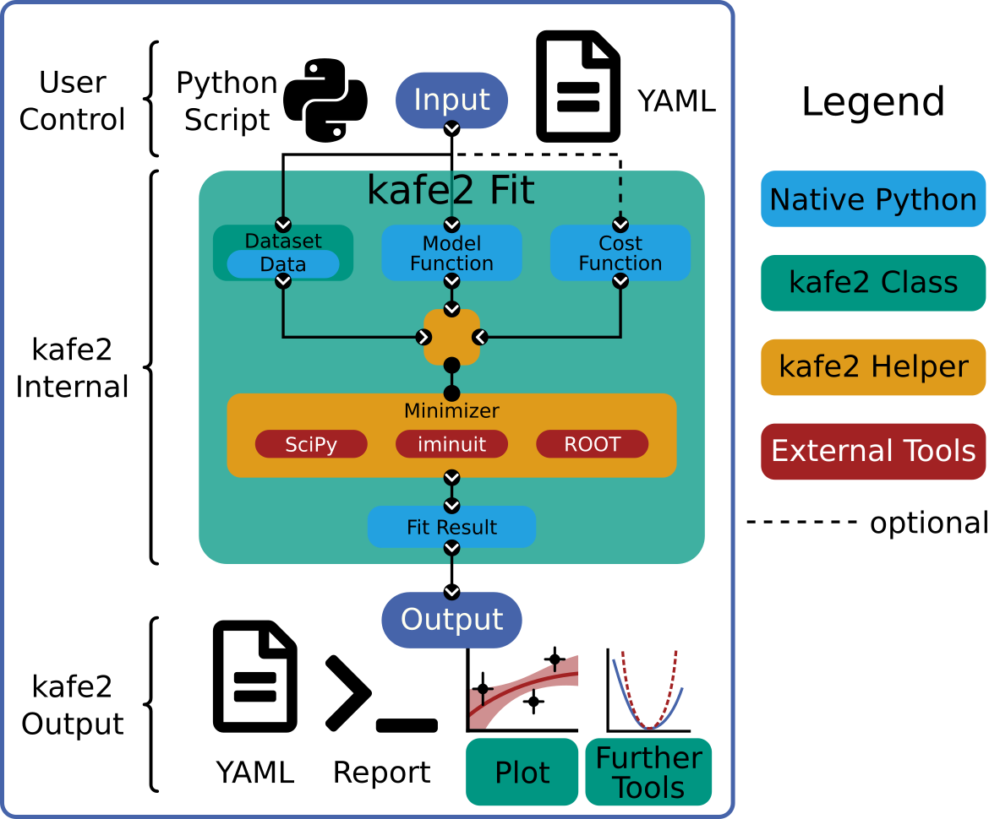

.. meta::
   :description lang=en: kafe2 - a Python-package for fitting parametric
                         models to several types of data with
   :robots: index, follow

.. _user_guide:

**********
User Guide
**********

For performing fits with *kafe2*, the user need to specify the data, model function and
optionally a cost function to be optimized. Mathematical details are explained
in section :ref:`Mathematical Foundations <mathematical_foundations>`.
In most cases the cost function defaults to a `negative-log-likelihood`
function or, in simple cases or if explicitely requested, the `least-squares` method.
This information is passed to a :py:obj:`~.FitBase`-derived object.
More information can be found in the :ref:`fitting`-section below.

Then there are multiple ways of displaying and using the fit results. They
can either be used directly inside a *Python*-script, printed to the terminal,
or :ref:`plotted <plotting>`. For further analysis, the
:ref:`contours-profiler` is a very helpful tool to display parameter
correlations.

Datasets
========
When performing fits with *kafe2*, the data is stored in so-called data containers
(:py:obj:`~.DataContainerBase`-derived objects).
The difference between the container classes comes down to the type of data they store.

There are two types of data supported by *kafe2*:
One-dimensional data like the lifetimes of particles following a probability density
function or two-dimensional data like a current-voltage characteristic.

* The most basic example of data is a simple series of one-dimensional data points called indexed
  data in *kafe2*
  (:py:obj:`~.IndexedContainer`).
* One-dimensional data can either be kept as-is or filled into a histogram ("*binning*").
  In *kafe2* these types of data and their corresponding fits are referred to as unbinned and
  histogram data/fits
  (:py:obj:`~.UnbinnedContainer` and :py:obj:`~.HistContainer`).
* Two-dimensional data and the corresponding fit is referred to as XY data/fit
  (:py:obj:`~.XYContainer`).

Setting the data
----------------
Data containers are created as regular Python objects from iterables (lists, arrays, etc.) of
floats.

XY Container
^^^^^^^^^^^^

.. code-block:: python

    from kafe2 import XYContainer
    # Create an XYContainer object to hold the xy data for the fit.
    xy_data = XYContainer(x_data=[1.0, 2.0, 3.0, 4.0],
                          y_data=[2.3, 4.2, 7.5, 9.4])

Unbinned and Indexed Container
^^^^^^^^^^^^^^^^^^^^^^^^^^^^^^

.. code-block:: python

    from kafe2 import IndexedContainer, UnbinnedContainer
    idx_data = IndexedContainer([5.3, 5.2, 4.7, 4.8])
    unbinned_data = UnbinnedContainer([5.3, 5.2, 4.7, 4.8])

Histogram Container
^^^^^^^^^^^^^^^^^^^
When creating a :py:obj:`~.HistContainer` the binning of the histogram has to be determined.
Equidistant bins can be created by using the ``n_bins`` and ``bin_range`` keywords.

.. code-block:: python

    from kafe2 import HistContainer
    histogram = HistContainer(n_bins=10, bin_range=(-5, 5))

Alternatively the ``bin_edges`` keyword can be used to directly specify bin edges with arbitrary
distances between them:

.. code-block:: python

    from kafe2 import HistContainer
    hist = HistContainer(bin_edges=[-5.0, -4.0, -3.0, -2.0, -1.0, 0.0, 1.0, 2.0, 3.0, 4.0, 5.0])

After setting the bin edges, the histogram can be filled with data points.
This can be done directly when creating the container with the ``fill_data`` keyword or
afterwards with the :py:meth:`~.HistContainer.fill` method.
Data points lying outside the bin range will be stored in an underflow or overflow bin and are
not considered when performing the fit.

.. code-block:: python

    from kafe2 import HistContainer
    histogram = HistContainer(n_bins=10, bin_range=(-5, 5),
                              fill_data=[-7.5, 1.23, 5.74, 1.9, -0.2, 3.1, -2.75, ...])
    # Alternative way
    histogram = HistContainer(n_bins=10, bin_range=(-5, 5))
    histogram.fill([-7.5, 1.23, 5.74, 1.9, -0.2, 3.1, -2.75, ...])

Instead of filling the histogram with raw data, the bin height can be set manually with
:py:meth:`~.HistContainer.set_bins`.
When doing so, rebinning and other options won't be available.

.. code-block:: python

    from kafe2 import HistContainer
    histogram = HistContainer(n_bins=5, bin_range=(0, 5))
    histogram.set_bins([1, 3, 5, 2, 0], underflow=2, overflow=0)

.. _container-labels:

Data and axis labels
--------------------

The name of the dataset or its label is set with the :py:meth:`~.DataContainerBase.label` property.
Axis labels can be set with the :py:meth:`~.DataContainerBase.x_label` and
:py:meth:`~.DataContainerBase.y_label` properties or the
:py:meth:`~.DataContainerBase.axis_labels` property:

.. code-block:: python

    from kafe2 import XYContainer
    xy_data = XYContainer(x_data=[1.0, 2.0, 3.0, 4.0], y_data=[2.3, 4.2, 7.5, 9.4])
    xy_data.label = 'My Data'
    xy_data.axis_labels = ['Time $\\tau$ (µs)', 'My $y$-label']

Text in between dollar signs will be interpreted as latex code.
The labels are displayed when plotting the fit results.

Uncertainties
-------------

To produce a meaningful fit result most cost functions require the user to specify uncertainties.
Independent uncertainties and correlated uncertainties are added using the same methods.

Independent uncertainties
^^^^^^^^^^^^^^^^^^^^^^^^^^
Independent uncertainties can be added to a dataset (:py:obj:`~.DataContainerBase`-derived objects)
with the :py:meth:`~.DataContainerBase.add_error` method:

.. code-block:: python

    from kafe2 import XYContainer
    x = [19.8, 3.0, 5.1, 16.1, 8.2,  11.7, 6.2, 10.1]
    y = [23.2, 3.2, 4.5, 19.9, 7.1, 12.5, 4.5, 7.2]
    data = XYContainer(x_data=x, y_data=y)
    data.add_error(axis='x', err_val=0.3)  # +/-0.3 for all data points in x-direction
    data.add_error(axis='y', err_val=0.15, relative=True)  # +/-15% for all points in y-direction

The ``axis`` keyword is is only used with XYContainers for the :py:obj:`~.XYContainer.add_error`
method.
If ``err_val`` is a single float the same uncertainty is applied to all data points.
If ``err_val`` is a list of floats with the same length as the corresponding data,
each entry in ``err_val`` is applied to the data point with the same index.

Correlated uncertainties
^^^^^^^^^^^^^^^^^^^^^^^^
If the correlation between the uncertainties for all data points is the same, the
:py:meth:`~.DataContainerBase.add_error` method can be used with the ``correlation`` keyword:

.. code-block:: python

    from kafe2 import IndexedContainer
    idx_data = IndexedContainer([5.3, 5.2, 4.7, 4.8])
    # independent uncertainties
    err_stat = idx_data.add_error([.2, .2, .2, .2])
    # uncertainty common to the first two values
    err_syst12 = idx_data.add_error([.175, .175, 0., 0.], correlation = 1.)
    # relative uncertainty common to the last two values
    err_syst34 = idx_data.add_error([0., 0., .05, 0.05], correlation = 1., relative=True)
    # uncertainty common to all values
    err_syst = idx_data.add_error(0.15, correlation = 1.)

Note that the above example does not make use of the ``axis`` keyword because indexed data is
one-dimensional.
By calling :py:meth:`~.DataContainerBase.add_error` multiple times the covariance matrix can be
constructed from multiple regular uncertainties.
The final covariance matrix can be accessed via the :py:meth:`~.DataContainerBase.cov_mat` property.
It is also possible to directly specify a more complicated uncertainty source as a covariance matrix
with the :py:meth:`~.DataContainerBase.add_matrix_error` method.
Please refer to the API documentation for more information.

.. _fitting:

Fitting
=======

Creating the correct :py:obj:`~.FitBase` derived object can simply be done with the
:py:meth:`~.Fit` function, which automatically determines the correct fit type for a
:py:obj:`~.DataContainerBase` derived object:

.. code-block:: python

    from kafe2 import XYContainer, Fit
    xy_data = XYContainer(x_data=[1.0, 2.0, 3.0, 4.0],
                          y_data=[2.3, 4.2, 7.5, 9.4])
    # Create an XYFit object from the xy data container.
    # By default, a linear function f=a*x+b will be used as the model function.
    line_fit = Fit(data=xy_data)
    # further additions like constraints go here
    line_fit.do_fit()

Alternatively :py:obj:`~.XYFit`, :py:obj:`~.HistFit`, :py:obj:`~.UnbinnedFit` or
:py:obj:`~.IndexedFit` can be used to create fits with corresponding datasets.

.. warning::

    Always run the :py:meth:`~.FitBase.do_fit` function of the Fit object when everything is set.
    Only when calling this function the fit will be performed.

Setting a model function
------------------------

*kafe2* fit objects accept normal Python functions as model functions.
The first parameter of those functions will be used as the independent parameter
(the parameter on the *x* axis of plots).
The default parameter values of the Python function will be used as starting values for the fit,
unless overwritten with the :py:meth:`~.FitBase.set_parameter_values` method.

.. code-block:: python

    def linear_model(x, a, b):
        # Our first model is a simple linear function
        return a * x + b

    def exponential_model(x, A0=1., x0=5.):
        # Our second model is a simple exponential function
        # The kwargs in the function header specify parameter defaults.
        return A0 * np.exp(x/x0)

    xy_data = XYContainer(x_data=[1.0, 2.0, 3.0, 4.0],
                          y_data=[2.3, 4.2, 7.5, 9.4])

    # Create 2 Fit objects with the same data but with different model functions
    linear_fit = Fit(data=xy_data, model_function=linear_model)
    exponential_fit = Fit(data=xy_data, model_function=exponential_model)

The display names for the model function and its parameters can be changed like this:

.. code-block:: python

    linear_fit.assign_model_function_name("line")
    linear_fit.assign_parameter_names(a='A', b='b', x='t')
    linear_fit.assign_model_function_expression("{a}{x} + {b}")
    exponential_fit.assign_model_function_latex_name("\\exp")
    exponential_fit.assign_parameter_latex_names(A0='A_0', x0='x_0', x='\\tau')
    exponential_fit.assign_model_function_latex_expression("{A0} e^{{{x}/{x0}}}")

The latex parameter names and expressions define the graphical output when plotting while the
non latex methods define the output names when reporting the fit results to the terminal.

.. note::

    Special characters inside the strings need to be escaped. E.g. a single ``\`` needs to be
    ``\\``.

.. note::

    Inside the latex expression string, ``{`` and ``}`` for latex expressions like ``\\frac``
    need to be doubled, because single curly brackets are used for replacing the parameters with
    their respective latex names.
    E.g. kafe2 tries to replace ``{x0}`` with its latex string ``x_0`` in this example.

.. _constraints_guide:

Parameter Constraints
---------------------

When performing a fit, some values of the model function might have already been determined in
previous experiments.
Those results and uncertainties can then be used to constrain the given parameters in a new fit.
This eliminates the need to manually propagate the uncertainties on the final fit results, as
it's now done numerically.

Simple parameter constraints are set with the :py:meth:`~.FitBase.add_parameter_constraint` method:

.. code-block:: python

    # Constrain model parameters to measurements
    fit.add_parameter_constraint(name='l',   value=l,   uncertainty=delta_l)
    fit.add_parameter_constraint(name='r',   value=r,   uncertainty=delta_r)
    fit.add_parameter_constraint(name='y_0', value=y_0, uncertainty=delta_y_0, relative=True)

.. note::
    The names have to be identical to the argument names in the model function. The parameter
    names can be accessed with the fit :py:meth:`~.FitBase.parameter_names` property.

If the uncertainties of several parameter constraints are correlated the
:py:meth:`~.FitBase.add_matrix_parameter_constraint` method can be used instead.
Please refer to the API Documentation for more information.

Fixing and limiting parameters
------------------------------

Limiting the parameters of a model function can be useful for improving the convergence of a fit
by reducing the size of the parameter space in which it searches for the global cost function
minimum.
This is commonly done when the fit result of one or more parameters is expected to fall in a certain
range or when the model function is not valid for some parameter values (e.g. a negative amplitude).
For fits with many parameters fixing some of them at first and fitting multiple times might also
help.

Fixing parameters is done with the :py:meth:`~.FitBase.fix_parameter` method and limiting with the
:py:meth:`~.FitBase.limit_parameter` method. Releasing a fixed parameter is performed with
:py:meth:`~.FitBase.release_parameter` and unlimiting a parameter with
:py:meth:`~.FitBase.unlimit_parameter`:

.. code-block:: python

    fit.fix_parameter("a", 1)
    fit.fix_parameter("b", 11.5)
    fit.release_parameter("a")
    # limit parameter fbg to avoid unphysical region
    fit.limit_parameter("fbg", 0., 1.)
    fit.unlimit_parameter("fbg")

.. note::
    The names have to be identical to the argument names in the model function. The parameter
    names can be accessed with the fit :py:meth:`~.FitBase.parameter_names` property.

Fixed parameters can be released with the :py:meth:`~.FitBase.release_parameter` method and
limited parameters can be unlimited with the :py:meth:`~.FitBase.unlimit_parameter` method.

.. _minimizers:

Minimizers
----------
Currently the use of three different minimizers is supported. By default :py:mod:`iminuit` is
used. If :py:mod:`iminuit` is not available, *kafe2* falls back to
:py:obj:`scipy.optimize.minimize`.

The usage of a specific minimizer can be set during initialization of any
:py:obj:`~.FitBase`-object with the `minimizer` keyword.
Depending on the installed minimizers this can either be :code:`'iminuit'`, :code:`'scipy'` or
:code:`'root'`.

Additional keywords for the instantiation can be passed as a :py:obj:`dict` via the
`minimizer_kwargs` keyword when creating a fit object derived from :py:obj:`~.FitBase`.

Logging
^^^^^^^
To enable the output of the minimizer, set up a logger before calling :py:func:`~.FitBase.do_fit`:

.. code-block:: python

    import logging
    logger = logging.getLogger()
    logger.setLevel(logging.INFO)

This currently only works for the :py:mod:`scipy` and :py:mod:`iminuit` minimizer.
For more detailed information increase the logging level to :py:const:`logging.DEBUG`.
This will give a more verbose output when using :py:mod:`iminuit`.
The logger level should be reset to :py:const:`logging.WARNING` before plotting.
Otherwise :py:mod:`matplotlib` will create logging messages as well.

Access the fit results
----------------------

The :py:meth:`~.FitBase.do_fit` method returns a dictionary containing most of the relevant
results. Additionally the results can be printed to the terminal with :py:meth:`~.FitBase.report`.
The parameter values can also be accessed via the :py:meth:`~.FitBase.parameter_values` property
as well as the symmetric and asymmetric parameter uncertainties and the correlation and
covariance matrices via their respective properties:

.. code-block::

    fit = Fit(my_dataset)  # create a fit object
    # perform the fit and calculate asymmetric uncertaintes
    result = fit.do_fit(asymmetric_parameter_errors=True)
    fit.report()  # print fit results to the terminal
    par_vals = fit.parameter_values
    par_errs = fit.parameter_errors
    par_errs_asym = fit.asymmetric_parameter_errors
    par_ocv_mat = fit.parameter_cov_mat
    par_cor_mat = fit.parameter_cor_mat

A typical dictionary returned by the :py:meth:`~.FitBase.do_fit` method looks like this:

.. code-block::

    {'did_fit': True,
     'cost': 1.7759115950075888,
     'ndf': 2,
     'goodness_of_fit': 1.7759115950075888,
     'cost/ndf': 0.8879557975037944,
     'chi2_probability': 0.41149607486886164,
     'parameter_values': OrderedDict([('a', 2.468773761415478), ('b', -0.3219331193129483)]),
     'parameter_cov_mat': array([[ 0.0443453 , -0.1108627 ],
                                 [-0.1108627 ,  0.33239252]]),
     'parameter_errors': OrderedDict([('a', 0.2105624096609012), ('b', 0.576478065203752)]),
     'parameter_cor_mat': array([[ 1.       , -0.9131448],
                                 [-0.9131448,  1.       ]]),
     'asymmetric_parameter_errors': None}

.. note::

    Asymmetric parameter uncertainties are only calculated when :py:meth:`~.FitBase.do_fit` is
    called with the corresponding keyword :code:`fit.do_fit(asymmetric_parameter_errors=True)`.
    Otherwise they will be :py:obj:`None`.

.. _plotting:

Plotting
========

For displaying the results of a Fit, *kafe2* provides a :py:obj:`~.Plot`-class. In the background
a :py:obj:`matplotlib.pyplot.figure`-object is created. This means that all customization possible
with *Matplotlib* can be done with *kafe2*-Plots as well.

The Plot class supports plotting multiple fits at once. By default they will all appear in the
same figure.
The keyword `separate_figures=True` changes this behaviour, so that each fit will be plotted to a
separate figure.

.. code-block:: python

    import matplotlib.pyplot as plt
    from kafe2 import Plot
    p = Plot([fit_1, fit_2])
    # for separate figures use:
    # p = Plot([fit_1, fit_2], separate_figures=True)
    # insert customization here
    p.plot()
    plt.show()

Running the :py:meth:`~.Plot.plot` function will perform the the plot. Customization should be
done before this. After plotting the fits, the according :py:mod:`matplotlib` objects can be
accessed via the :py:attr:`~.Plot.figures` and :py:attr:`~.Plot.axes` properties.

Customize the Plot
------------------

Model and parameter labels
^^^^^^^^^^^^^^^^^^^^^^^^^^

The model and parameter labels that appear in the plot info box can be set like this:
.. code-block:: python
    # Assign the LaTeX-names that are used in the plot info box (legend):
    fit.assign_parameter_latex_names(x='t', a='\\alpha', b='\\beta')
    fit.assign_model_function_latex_name('\\theta')
    fit.assign_model_function_latex_expression('{a} \\cdot {x} + {b}')

Labels can be set for a fit.
These labels are then used by all Plots created from said fit.
If a Plot object also defines labels those labels override the fit labels.
.. code-block:: python
    # The labels displayed in the info box:
    fit.data_container.label = "data label"
    fit.model_label = "model label"

    # The labels displayed on the x- and y-axis:
    fit.data_container.axis_labels = ["x label", "y label"]

Plot Style
^^^^^^^^^^

.. note::

    The :py:meth:`~.Plot.plot` method must be called after all customization is done. Otherwise
    not all customizations will appear in the plot.

Each graphic element has it's own plotting method and can be customized individually. Available
*plot_types* for XYFits are
:code:`'data', 'model_line', 'model_error_band', 'ratio', 'ratio_error_band'` and 'model' which
is hidden by default.
The *plot_types* may differ for different types of fits.

The currently set keywords can be obtained with the :py:meth:`~.Plot.get_keywords` method.
With :py:meth:`~.Plot.customize` new values can be added or existing values can
be modified. Using :code:`'__del__'` will delete the keyword and :code:`'__default__'` will reset
it.
.. code-block:: python
    plot.customize('data', 'marker', 'X')  # Set the data marker shape
    plot.customize('data', 'markersize', 10)  # Set the data marker size
    plot.customize('data', 'color', '#600E8F')  # Set the data marker color
    plot.customize('data', 'ecolor', '#8F0BDB')  # Set the errorbar color
    plot.customize('data', 'label', 'data label')  # Overwrite the data label in the info box

    plot.customize('model_line', 'linestyle', ':')  # Set the linestyle for the model line
    plot.customize('model_line', 'linewidth', 2)  # Set the line width for the model line
    plot.customize('model_line', 'color', '#8F1B0E')  # Set the color of the model line
    plot.customize('model_line', 'label', 'model line label')  # Overwrite the model label in the info box

    plot.customize('model_error_band', 'alpha', 0.2)  # Set the alpha value (transparency) for the error band
    plot.customize('model_error_band', 'linestyle', '--')  # Set the linestyle for the border of the error band
    plot.customize('model_error_band', 'linewidth', 3)  # Set the linewidth for the border of the error band
    plot.customize('model_error_band', 'color', '#DB1F0B')  # Set the color of the error band
    plot.customize('model_error_band', 'label', 'model error band label')  # Set the label for the error band

    # Analogous to data: set the appearance for the residual
    plot.customize('residual', 'marker', 'X')
    plot.customize('residual', 'markersize', 10)
    plot.customize('residual', 'color', '#600E8F')
    plot.customize('residual', 'ecolor', '#8F0BDB')

    # Analogous to model error band: set the appearance for the residual error band
    plot.customize('residual_error_band', 'alpha', 0.2)
    plot.customize('residual_error_band', 'linestyle', '--')
    plot.customize('residual_error_band', 'linewidth', 3)
    plot.customize('residual_error_band', 'color', '#DB1F0B')

To hide entries in the info box you can do this:
.. code-block::python
    plot.customize('data', 'label', None)

To hide specific elements of the plot (e.g. error bands) you can do this:
.. code-block::python
    plot.customize('model_error_band', 'hide', True)

Additionally it is possible to change parameters using matplotlib functions.
Changing the size of the axis labels is done with the following calls:
.. code-block:: python
    import matplotlib as mpl
    mpl.rc('axes', labelsize=20, titlesize=25)

Axis Range
^^^^^^^^^^

The plot range can be set via the :py:attr:`~.Plot.x_range` and :py:attr:`~.Plot.y_range` properties:
.. code-block:: python
    plot.x_range = (0.5, 4.5)  # Set the range of the x-axis
    plot.y_range = (2, 10)  # Set the range of the y-axis

Axis Labels
^^^^^^^^^^^

By default, the plot will use the labels specified for each dataset (see :ref:'container-labels').
If multiple fits are plotted to the same figure, the axis labels from the data containers are concatenated while skipping duplicates.
Alternatively the axis labels can be overwritten for each fit.
Again if multiple fits are plotted to the same figure, all labels will be concatenated while skipping duplicates.
.. code-block::python
    plot.x_label = 'x label'  # Overwrite the label of the x-axis
    plot.y_label = 'y label'  # Overwrite the label of the y-axis

Axis Scale
^^^^^^^^^^

Additionally the axis scale can be changed to logarithmic.
When changing between a linear and logarithmic x-axis scale, the supporting points for plotting the model function will be updated and evenly spaced on a linear or logarithmic scale.
.. code-block::python
    plot.x_scale = 'linear'  # Set the scale of the x-axis to linear (default)
    plot.y_scale = 'log'  # Set the scale of the y-axis to logarithmic

The resulting plot will look like this:
.. figure::doc/src/_static/img/005_customize_customized_plot.png
    :alt: The customized plot

If you want to plot multiple plot_objects you have to pass a list of matching length as the attribute:
.. code-block:: python
    # if all plots will have the same attribute you can waive the list an d just pass the attribute
    plot.customize('model_error_band', 'hide', [True, False])

In order to change the name for the data set and suppress the second output, use the following call:
.. code-block:: python
    plot.customize('data', 'label', [(0, "test data"), (1, '__del__')])

.. _contours-profiler:

Contours Profiler
=================

.. todo::

    Add this section, examples already use the contours profiler.
