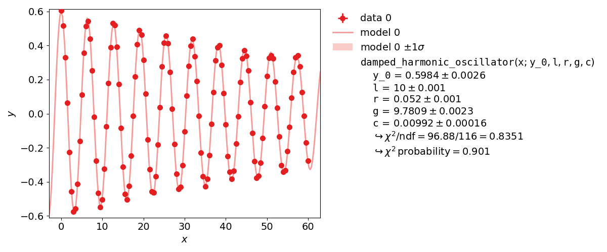

.. meta::
   :description lang=en: kafe2 - a Python-package for fitting parametric
                         models to several types of data with
   :robots: index, follow

.. role:: python(code)

**********
User Guide
**********

This user guide covers the basics of using *kafe2* for
fitting parametric models to data.
Specifically, it teaches users how to specify measurement 
data and uncertainties, how to specify model functions, 
and how to extract the fit results.

Basic Fitting Procedure
=======================

Generally, any simple fit performed with the *kafe2* framework 
can be divided into the following steps:

1. Specifying the data
2. Specifying the uncertainties
3. Specifying the model function
4. Performing the fit
5. Extracting the fit results

This document will gradually introduce the above steps via example code.

Using kafe2go
-------------
Using *kafe2go* is the simplest way of performing a fit. Here all the necessary
information like data and uncertainties is specified in the *YAML* data format.
To perform the fit, simply run

.. code-block:: bash

    kafe2go path/to/fit.yml

Using Python
------------
When using *kafe2* via a *Python* script a fine control of the fitting- and
plotting-procedure is possible. For using *kafe2* inside a *Python* script, import the required
*kafe2* modules:

.. code-block:: python

    from kafe2 import XYFit, Plot

Example 1: Line Fit
===================
The first example is the simplest use of a fitting framework, performing a line fit.
A linear function of the form :math:`f(x;a, b) = a x + b` is made to align with
a series of xy data points that have some uncertainty along the x-axis
and the y-axis.
This example demonstrates how to perform such a line fit in kafe2 and
how to extract the results.

.. figure:: ../_static/img/001_line_fit.png
    :alt: Plot of a line fit performed with kafe2.

kafe2go
-------
To run this example, open a text editor and save the following file contents
as a *YAML* file named :file:`line_fit.yml`.

.. literalinclude:: ../../../examples/001_line_fit/line_fit.yml

Then open a terminal, navigate to the directory where the file is
located and run

.. code-block:: bash

    kafe2go line_fit.yml

Python
------
The same fit can also be performed by using a *Python* script.

.. bootstrap_collapsible::
    :control_type: link
    :control_text: python code

    .. literalinclude:: ../../../examples/001_line_fit/line_fit.py
        :lines: 15-

Example 2: Model Functions
==========================

In experimental physics a line fit will only suffice for a small number
of applications. In most cases you will need a more complex model function
with more parameters to accurately model physical reality.
This example demonstrates how to specify arbitrary model functions for
a kafe2 fit.
When a different function has to be fitted, those functions need to be defined either in the
*YAML* file or the *Python* script.

.. figure:: ../_static/img/002_model_comparison.png
    :alt: Comparison of a line and exponential fit with kafe2.

The expectation value of :math:`\chi^2/\mathrm{ndf}` is 1. Thus the exponential function
more accurately describes the dataset than a line function.

An exponential function is a **non-linear** function! Therefore the fit parameters can be heavily
correlated. To verify this, please create a contour plot of the fitted parameters.
This can be done by appending the ``-c`` or ``--contours`` option to *kafe2go*. Additionally a
grid can be added to the contour plots with the ``--grid all`` flag.
To achieve the same with a *Python* script, import the ``ContoursProfiler`` with
:python:`from kafe2 import ContoursProfiler`. This class can create contour and profile plots.
The usage is shown in the following code example.

By creating the contours in a *Python* script the user has a finer control on which parameters to
use as well on the appearance of the contour plot via various keyword arguments.

The according contour plot to the exponential fit shown above looks like this:

.. figure:: ../_static/img/002_exponential_contours.png
    :alt: Contour plot corresponding to the exponential fit.

When looking at the :math:`1\sigma` contour it's slightly visible, that the contour is not
perfectly elliptical. But in this case the deformation is very small and is negligible.
If a contour is not elliptical it is good practice to show the contour plot in addition to the
uncertainties from the fit. This illustrates the correlation of the parameters.

kafe2go
-------
Inside a *YAML* file custom fit functions are defined with the ``model_function`` keyword.
The custom function must be a python function. Numpy is supported as shown in the example.
For more advanced fit functions, consider using *kafe2* inside a *Python* script.

.. bootstrap_collapsible::
    :control_type: link
    :control_text: exponential_fit.yml

    .. literalinclude:: ../../../examples/002_model_functions/exponential_fit.yml
        :emphasize-lines: 28-32

.. bootstrap_collapsible::
    :control_type: link
    :control_text: line_fit.yml

    .. literalinclude:: ../../../examples/002_model_functions/line_fit.yml
        :emphasize-lines: 28-31

To use multiple input files with kafe2go, simply run

.. code-block:: bash

    kafe2go path/to/fit1.yml path/to/fit2.yml

To plot the fits in two separate figures append the ``--separate`` flag to the kafe2go command.

.. code-block:: bash

    kafe2go path/to/fit1.yml path/to/fit2.yml --separate

Python
------
Inside a *Python* script a custom function ist defined like this:

.. literalinclude:: ../../../examples/002_model_functions/model_functions.py
    :lines: 17-26

Those functions are passed on to the Fit objects:

.. literalinclude:: ../../../examples/002_model_functions/model_functions.py
    :lines: 33-35

It's also possible to assign LaTeX expressions to the function and its variables.

.. literalinclude:: ../../../examples/002_model_functions/model_functions.py
    :lines: 37-41

Please note, that the function LaTeX expression needs to contain all parameters present in the
function definition. The placeholders are then automatically replaced by their corresponding LaTeX
names. Due to the way *Python* handles the string formatting, curly braces used in LaTeX need to
be doubled, as in the code example.

The full example additionally contains the creation of a contour plot. The corresponding lines are
highlighted in the following example.

.. bootstrap_collapsible::
    :control_type: link
    :control_text: python code

    .. literalinclude:: ../../../examples/002_model_functions/model_functions.py
        :lines: 13-
        :emphasize-lines: 43-45

Example 3: Parameter Constraints
================================

The models used to describe physical phenomena usually depend on a multitude of parameters.
However, for many experiments only one of the parameters is of actual interest to the experimenter.
Still, because model parameters are generally not uncorrelated the experimenter has to factor in
the nuisance parameters for their estimation of the parameter of interest.

Historically this has been done by propagating the uncertainties of the nuisance parameters onto
the y-axis of the data and then performing a fit with those uncertainties.
Thanks to computers, however, this process can also be done numerically by applying parameter
constraints. This example demonstrates the usage of those constraints in the kafe2 framework.

More specifically, this example will simulate the following experiment:

A steel ball of radius :math:`r` has been connected to the ceiling by a string of length :math:`l`,
forming a pendulum. Due to earth's gravity providing a restoring force this system is a harmonic
oscillator. Because of friction between the steel ball and the surrounding air the oscillator is
also damped by the viscous damping coefficient :math:`c`.

The goal of the experiment is to determine the local strength of earth's gravity :math:`g`. Since
the earth is shaped like an ellipsoid the gravitational pull varies with latitude: it's strongest
at the poles with :math:`g_p=9.832\,\mathrm{m}/\mathrm{s}^2` and it's weakest at the equator with
:math:`g_e=9.780\,\mathrm{m}/\mathrm{s}^2`. For reference, at Germany's latitude g lies at
approximately :math:`9.81\,\mathrm{m}/\mathrm{s}^2`.

          gravitational pull g.

kafe2go
-------

Parameter constraints are straightforward to use with *kafe2go*. After defining the model function
parameter constraints can be set. The constraints require an index to be set. This index
corresponds with the parameter order of the fit function. So the first free parameter uses index 0,
the second index 1.
The according lines are highlighted in the example file below.

.. bootstrap_collapsible::
    :control_type: link
    :control_text: constraints.yml

    .. literalinclude:: ../../../examples/003_constraints/constraints.yml
        :emphasize-lines: 50-

Python
------

Using *kafe2* inside a *Python* script, parameter constraints can be set with
``fit.add_parameter_constraint()``. The according section is highlighted in the code example below.

.. bootstrap_collapsible::
    :control_type: link
    :control_text: constraints.yml

    .. literalinclude:: ../../../examples/003_constraints/constraints.py
        :lines: 26-
        :emphasize-lines: 28-32
