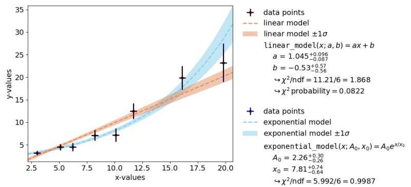
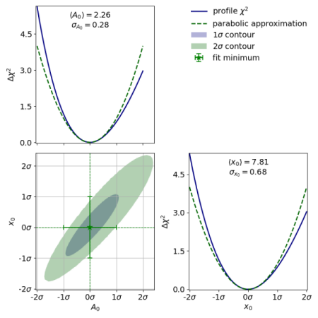

<!--
This is the source for https://kafe2.github.io/index.html,
generated via   pandoc README.md -o index.html
-->

<style> 
  body {
    background-color:white; 
    text-align:justify; 
    max-width:50em;
  }
  h1 {
    align:center;
    background-color:GhostWhite;
  }
  p {
    background-color:white;
  }
</style>

<!-- header -->
<p  style="background-color:AliceBlue;">   </p>
 <br>
<h1> <i>kafe2</i> - Data Visualisation and Model Fitting </h1>
  > &nbsp; &nbsp; &nbsp; &nbsp; &nbsp; 
    Link to [**github Repository** of the *kafe2* project](
    https://github.com/PhiLFitters/kafe2). 
<p  style="background-color:AliceBlue;">  <hr>  </p>

<!-- body -->

## **_kafe2_**  

&nbsp; is an open-source <i>Python</i> package for the likelihood-based
estimation of parameters from measured data.
Its selling points are

1. that it offers state-of-the-art statistical methods
   (e.g. confidence intervals/regions based on the profile likelihood method),
2. that it only uses open-source software which allows users to understand and reproduce results with relative ease,
3. and that it offers an easy-to-use and performance-optimized pipeline that takes numerical data and
   produces for example parameter confidence intervals or publication-quality plots.

Let's look at a brief example:

``` python
import kafe2

# Just some numerical data:
x_data = [1.0, 2.0, 3.0, 4.0]
y_data = [2.3, 4.2, 7.5, 9.4]

kafe2.xy_fit(x_data, y_data, x_error=0.1, y_error=[0.40, 0.45, 0.40, 0.25],
             y_error_cor_rel=0.05)
kafe2.plot(x_label="$t$ [s]", y_label="$h$ [m]")
```

With just two function calls we get the following plot:



Ignoring imports and variable definitions the example consists of just two function calls
but a lot is happening under the hood:

1. A negative log-likelihood (NLL) function given the data and uncertainties is constructed.
   Uncertainties in x and y direction can be defined as either absolute or relative,
   and as either correlated or uncorrelated.
   If a simple float is provided as input the same amount of uncertainty is applied to each data point.
   Since the user did not specify a model function a line is used by default.
2. A numerical optimization algorithm is applied to the likelihood function to find the
   best estimates for the model parameter values.
3. Because the user defined uncertainties in x direction and uncertainties relative to the y model values
   the total covariance matrix has become a function of the model parameters.
   It is therefore necessary to re-calculate the total covariance matrix at each optimization step;
   while somewhat computationally expensive this ensures that the fit result is unbiased and that
   the parameter confidence intervals have optimal statistical coverage.
   Due to the parameter-dependent uncertainties the regression problem as a whole has also become nonlinear.
   _kafe2_ recognizes the change and switches from estimating symmetrical parameter uncertainties from the
   Cramér-Rao-Frechét bound to estimating confidence intervals via the profile likelihood method.
4. The data and model are plotted along with a confidence band for the model function.
   A legend containing information about the model, the parameter estimates, and the results of a hypothesis test
   (Pearson's chi-squared test) is added automatically.
5. Because the regression problem is nonlinear _kafe2_ by default also produces plots of the confidence intervals
   of single model parameters as well as plots of the confidence regions of pairs of parameters:
   


The above example is of course highly configurable:
among other things users can define arbitrarily complex _Python_ functions to model the data,
they can switch to different data types (e.g. histogram data),
they can use different likelihoods (e.g. Poisson),
or they can simultaneously fit multiple models with shared parameters.
Since tools have an inherent trade-off between usability and complex functionality 
_kafe2_ offers several interfaces for fitting:

* For users that have no programming knowledge a command line interface "_kafe2go_" is provided.
  Users only have to write a configuration file in _YAML_ (a standard data serialization language).
* Slightly more advanced users that do have programming knowledge can call the _Python_ interface
  of the _kafe2_ pipeline as part of a larger _Python_ script.
* Advanced users can construct custom pipelines by directly using the _kafe2_ objects
  that represent for example data or plots.

By offering several interfaces with varying levels of complexity _kafe2_ aims to meet the needs of
both beginners and experts.
To learn more we invite you to take a look at the [full **documentation**](
https://kafe2.readthedocs.io/en/latest/).

